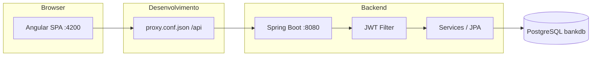

# Find Card

Aplicação web de gestão bancária com **painéis por perfil** (cliente, administrador e funcionário), autenticação **JWT** e operações sobre contas (consulta, depósito, levantamento e transferência).

Repositório: [github.com/rusergio/find-card](https://github.com/rusergio/find-card)

---

## Visão geral

O **Find Card** é um sistema full-stack pensado para demonstrar um fluxo bancário completo:

- Registo e login de utilizadores
- Contas bancárias associadas a cada cliente
- Movimentação de saldo com histórico de transações
- Interfaces separadas conforme o papel do utilizador

| Camada      | Tecnologia                                      |
| ----------- | ----------------------------------------------- |
| Frontend    | Angular 21, PrimeNG, Tailwind CSS 4             |
| Backend     | Spring Boot 4, Spring Security, Spring Data JPA |
| Base de dados | PostgreSQL                                    |
| Autenticação | JWT (Bearer token)                           |
| API docs    | SpringDoc OpenAPI (Swagger UI)                  |

---

## Arquitetura



Em desenvolvimento, o Angular (`ng serve`) expõe a app em `http://localhost:4200` e reencaminha pedidos `/api/*` para o Spring Boot em `http://localhost:8080` (ver `frontend-angular/proxy.conf.json`).

---

## Estrutura do repositório

```
find-card/
├── docker-compose.yml    # Orquestração (PostgreSQL + API + frontend)
├── .env.example          # Variáveis Docker (copiar para .env)
├── frontend-angular/     # SPA Angular (bank-management)
│   ├── src/app/
│   │   ├── core/         # Auth, guards, serviços API
│   │   └── features/
│   │       ├── auth/     # Login e registo
│   │       ├── admin/    # Painel administrador
│   │       ├── client/   # Painel cliente
│   │       └── employee/ # Painel funcionário
│   └── proxy.conf.json
└── backend-java/
    └── bank-api/         # API REST Spring Boot
        └── src/main/java/com/bank/bank_api/
```

---

## Perfis de utilizador

| Backend (`Role`) | Frontend (`UserRole`) | Descrição |
| ---------------- | --------------------- | --------- |
| `USER`           | `CLIENT`              | Cliente: vê e opera apenas nas suas contas |
| `ADMIN`          | `ADMIN`               | Administrador: acesso alargado (ex.: todas as contas) |
| `EMPLOYEE`       | `EMPLOYEE`            | Funcionário: área reservada (evolução futura) |

Rotas principais do frontend:

| Rota | Acesso |
| ---- | ------ |
| `/login`, `/register` | Convidado (não autenticado) |
| `/client/*` | Cliente (`CLIENT`) |
| `/admin/*` | Administrador (`ADMIN`) |
| `/employee/*` | Funcionário (`EMPLOYEE`) |

### Utilizador de demonstração (seed)

Ao arrancar o backend pela primeira vez, é criado automaticamente um administrador (se ainda não existir):

| Campo    | Valor |
| -------- | ----- |
| Email    | `admin@bank.com` |
| Password | `admin123` |

> Altere estas credenciais em ambientes reais.

---

## API REST (resumo)

Base URL em desenvolvimento (via proxy): `http://localhost:4200/api` → `http://localhost:8080`

### Autenticação (público)

| Método | Endpoint | Descrição |
| ------ | -------- | --------- |
| `POST` | `/auth/login` | Login — devolve JWT |
| `POST` | `/auth/register` | Registo de cliente + conta inicial |
| `GET`  | `/auth/me` | Perfil do utilizador autenticado |

### Contas (autenticado)

| Método | Endpoint | Descrição |
| ------ | -------- | --------- |
| `GET`  | `/accounts` | Listar contas (todas se ADMIN) |
| `GET`  | `/accounts/{id}` | Detalhe de uma conta |
| `POST` | `/accounts/deposit` | Depósito |
| `POST` | `/accounts/withdraw` | Levantamento |
| `POST` | `/accounts/transfer` | Transferência entre contas |

### Cartões de pagamento (autenticado)

Tabela PostgreSQL: `payment_cards` (ligada a `users`). Guarda apenas **últimos 4 dígitos** e validade — nunca o número completo nem o CVV.

| Método | Endpoint | Descrição |
| ------ | -------- | --------- |
| `GET`  | `/payment-cards` | Listar cartões do utilizador |
| `POST` | `/payment-cards` | Registar cartão (`holderName`, `cardNumber`, `expiry`, `cvc`) |

### Utilizadores e transações

| Método | Endpoint | Descrição |
| ------ | -------- | --------- |
| `POST` | `/users` | Criar utilizador (apenas `ADMIN`) |
| `GET`  | `/transactions/account/{accountId}` | Histórico por conta |

Pedidos protegidos devem incluir o header:

```http
Authorization: Bearer <token_jwt>
```

Documentação interativa (com o backend a correr): [http://localhost:8080/swagger-ui.html](http://localhost:8080/swagger-ui.html)

---

## Pré-requisitos

**Com Docker (recomendado)**

- [Docker Desktop](https://www.docker.com/products/docker-desktop/) (ou Docker Engine + Compose v2)

**Desenvolvimento local (sem Docker)**

- **Node.js** 20+ e **npm** 10+
- **Java** 17+
- **Maven** 3.9+ (ou usar o wrapper se existir no projeto)
- **PostgreSQL** 14+

---

## Docker (tudo num comando)

Na raiz do projeto:

```bash
cp .env.example .env
docker compose up --build
```

| Serviço    | URL no browser                          |
| ---------- | --------------------------------------- |
| Aplicação  | http://localhost (porta `FRONTEND_PORT`, default **80**) |
| API        | http://localhost:8080                   |
| Swagger    | http://localhost:8080/swagger-ui.html |
| PostgreSQL | `localhost:5432` (user/password no `.env`) |

O Nginx no contentor `frontend` serve o Angular e reencaminha `/api/*` para o Spring Boot — o browser só fala com uma origem, sem problemas de CORS.

### Comandos úteis

```bash
# Em segundo plano
docker compose up -d --build

# Parar e remover contentores
docker compose down

# Parar e apagar volume da BD (reset total)
docker compose down -v

# Ver logs
docker compose logs -f api
```

### Contentores

| Contentor            | Imagem / build      | Função              |
| -------------------- | ------------------- | ------------------- |
| `find-card-db`       | `postgres:16-alpine`| Base de dados       |
| `find-card-api`      | `backend-java/bank-api/Dockerfile` | API Spring Boot |
| `find-card-frontend` | `frontend-angular/Dockerfile`    | Nginx + SPA     |

Credenciais de demo (seed): `admin@bank.com` / `admin123` — criadas automaticamente ao arrancar a API.

---

## Configuração e execução (local, sem Docker)

### 1. Base de dados PostgreSQL

Crie a base de dados:

```sql
CREATE DATABASE bankdb;
```

### 2. Backend (Spring Boot)

```bash
cd backend-java/bank-api
```

Copie o ficheiro de exemplo e ajuste utilizador/password da BD:

```bash
cp src/main/resources/application.properties.example src/main/resources/application.properties
```

Edite `application.properties` com as suas credenciais locais.

Arranque a API:

```bash
mvn spring-boot:run
```

A API fica disponível em **http://localhost:8080**.

### 3. Frontend (Angular)

```bash
cd frontend-angular
npm install
npm start
```

A aplicação abre em **http://localhost:4200** (proxy `/api` → backend).

### Build de produção (frontend)

```bash
cd frontend-angular
npm run build
```

Configure `src/environments/environment.prod.ts` e um reverse proxy (Nginx, Laragon, etc.) para servir o frontend e encaminhar `/api` para o JAR do Spring Boot.

---

## Variáveis e ficheiros sensíveis

Não versione credenciais reais. O repositório inclui:

- `backend-java/bank-api/src/main/resources/application.properties.example` — modelo de configuração
- `application.properties` local — ignorado pelo Git (crie a partir do exemplo)

O segredo JWT está atualmente definido no código (`JwtService`); para produção, mova-o para variáveis de ambiente ou um gestor de segredos.

---

## Funcionalidades por área (frontend)

### Cliente (`/client`)

- Dashboard e listagem de contas
- Gestão de conta (depósito, levantamento, transferência)
- Perfil e definições

### Administrador (`/admin`)

- Dashboard
- Gestão de funcionários
- Gestão de contas (visão alargada)
- Perfil e definições

### Funcionário (`/employee`)

- Dashboard
- Operações
- Definições

---

## Roadmap (próximas iterações)

- Reforço do perfil `EMPLOYEE` no backend
- Recuperação de password (`/auth/forgot-password` no frontend)
- Configuração JWT e BD via variáveis de ambiente
- Testes automatizados (backend e frontend)

---

## Licença

Projeto em desenvolvimento. Defina a licença conforme a política do autor/repositório.

---

## Autor

**rusergio** — [GitHub](https://github.com/rusergio)
